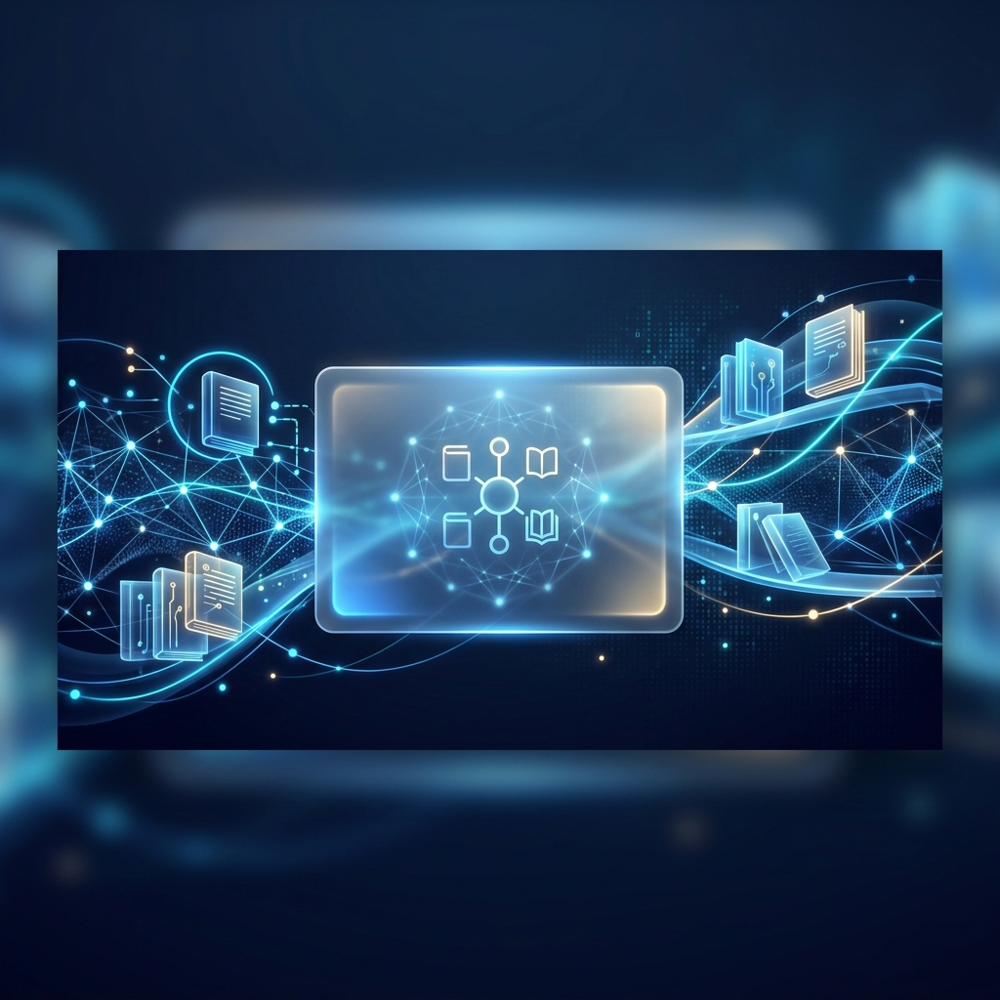

# Net-Library | The Future of Digital Reading

<p align="center">
  
</p>

> **"Where the weight of physical books meets the zero-gravity efficiency of digital management."**
>
> **Net-Library** is not just a library system; it's a high-performance neural gateway to knowledge. Built with precision engineering and an uncompromising focus on aesthetics, it redefines how institutions manage assets and how members discover them.

---

### 🛡️ Tech Stack
<p align="left">
  
  
  
  
</p>

---

## 💎 Enterprise Features Highlight

*   ✨ **Deep Glassmorphism UI**: A stunning "Antigravity" design system featuring frosted glass effects, neon glows, and seamless responsive transitions.
*   🌓 **Dual-Theme Engine**: State-of-the-art Dark and Light modes that respect user preferences and system settings with zero-flash transitions.
*   🌐 **Global Localization**: Fully localized in **Indonesian (ID)** and **English (EN)**. A scalable translation architecture using Laravel's core localization system.
*   🔐 **Strict RBAC Security**: Role-Based Access Control ensuring distinct operational silos for Admins, Staff, and Members with layout-level separation.
*   📊 **Advanced Interactions**: Sophisticated user engagement tools: Persistent Wishlists, Neural Reviews (Rating System), and Live Statistics.
*   ❓ **Dynamic Help Center**: A role-aware help system that provides specific operational protocols based on the authenticated entity's permissions.

---

## 🏗️ System Architecture (Roles & Capabilities)

Our neural network is divided into three distinct authority layers, each with a custom-tailored interface:

| Node Role | Access Level | Primary Capabilities |
| :--- | :--- | :--- |
| **Admin** | **Command Center** | Full identity management (Nodes), system-wide transaction oversight, strategic reporting, and architectural configuration. |
| **Petugas** | **Operations** | Real-time circulation validation (Borrow/Return), inventory synchronization, stock adjustment, and repository maintenance. |
| **Pengunjung** | **Members** | Repository exploration (Catalog), asset borrowing requests, profile synchronization, wishlist persistence, and review transmission. |

---

## 🚀 Installation & Setup Guide

Deploy the Net-Library ecosystem to your local neural network with these standard protocols:

### 1. Initialize Repository
```bash
git clone https://github.com/your-username/net-library.git
cd net-library
```

### 2. Dependency Synchronization
```bash
composer install
npm install
```

### 3. Environment Configuration
Create your configuration file and generate the application encryption key:
```bash
cp .env.example .env
php artisan key:generate
```
> [!IMPORTANT]
> Ensure your `DB_DATABASE`, `DB_USERNAME`, and `DB_PASSWORD` are correctly configured in the `.env` file before proceeding to migrations.

### 4. Neural Database Migration
Populate the system with the initial data set and establish administrative credentials:
```bash
php artisan migrate --seed
```

### 5. Asset Linking
Establish the neural link for storage assets (avatars, covers):
```bash
php artisan storage:link
```

### 6. Ignition
Launch the dual-stream server to start the experience:
```bash
# Terminal 1: Backend
php artisan serve

# Terminal 2: Frontend (Vite)
npm run dev
```

---

<p align="center">
  <b>Designed with love by Antigravity</b><br>
  <i>Net-Library Enterprise v2.0 &bull; Precision Engineered for the Future</i>
</p>
